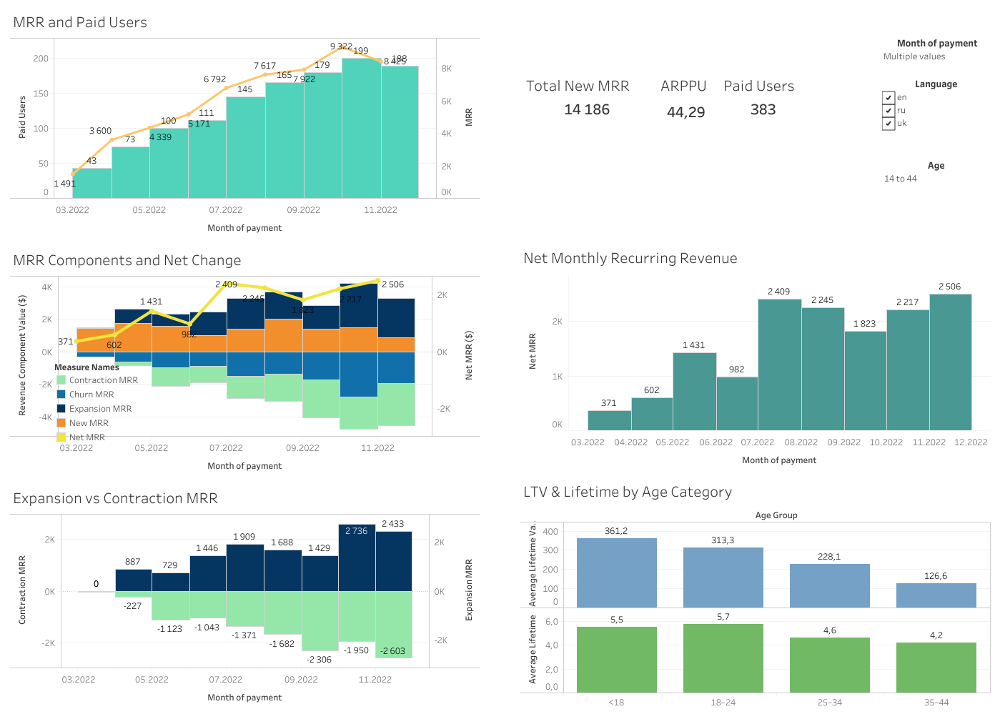

## 📊 Revenue Metrics Dashboard

This project presents a comprehensive dashboard for tracking and analyzing revenue dynamics over time.  
It combines SQL for data processing and Tableau Public for data visualization.

> 🔄 Also available in [Ukrainian version](README_uk.md)

---

### 🎯 Project Objective

To create a dashboard for monitoring changes in financial revenue over time and analyzing the factors behind these changes. The dashboard is intended to help (hypothetical) product managers perform top-level analysis.

---

### 📌 Key Metrics Included

- **Monthly Recurring Revenue (MRR)** — total revenue for a calendar month from recurring sources.
- **Paid Users** — number of paying users per month.
- **Average Revenue Per Paid User (ARPPU)** — revenue divided by the number of paying users.
- **New Paid Users** — users who started paying during a given month.
- **New MRR** — MRR generated by new paid users.
- **Churned Users** — users who stopped paying in a given month.
- **Churn Rate** — Churned Users (current month) / Paid Users (previous month).
- **Churned Revenue** — revenue from users who churned, measured in the previous month.
- **Revenue Churn Rate** — Churned Revenue / MRR of the previous month.
- **Expansion MRR** — revenue increase from users who paid more than the previous month.
- **Contraction MRR** — revenue loss from users who paid less than the previous month.
- **Net MRR** — New MRR + Expansion MRR − Churned Revenue − Contraction MRR.
- **Customer Lifetime (LT)** — average number of months a user stays active.
- **Customer Lifetime Value (LTV)** — total revenue per average user over their lifetime.

---

### 🔗 Live Dashboard

[View on Tableau Public](https://public.tableau.com/views/RevenueMetricsAnalysis_17484591293240/Dashboard4?:language=en-US&:sid=&:redirect=auth&:display_count=n&:origin=viz_share_link)

---

### 📈 Dashboard Visualizations Overview

1. **MRR and Paid Users**  
   A dual-axis chart displaying the total number of paid users (bars) and Monthly Recurring Revenue (MRR) (line) per month.  
   It shows how the user base growth correlates with recurring revenue increases.

2. **Key Metrics Summary**  
   Three numeric metrics providing a high-level overview of business performance:

   - **Total New MRR**
   - **ARPPU**
   - **Total Paid Users**

3. **MRR Components and Net Change**  
   A stacked bar chart breaking down MRR into four components:

   - New MRR
   - Expansion MRR
   - Contraction MRR
   - Churned Revenue  
     A yellow line overlays the chart, showing the Net MRR change for each month.

4. **Net Monthly Recurring Revenue**  
   A separate bar chart visualizing Net MRR per month to clearly highlight total monthly growth or loss in recurring revenue.

5. **Expansion vs Contraction MRR**  
   A diverging bar chart displaying monthly Expansion MRR and Contraction MRR values side by side, emphasizing the internal revenue fluctuations from existing users.

6. **LTV & Lifetime by Age Category**  
   A grouped bar chart showing two customer behavior metrics across age segments:
   - Average Customer Lifetime (months)
   - Average LTV (lifetime value in revenue)

The dashboard also includes interactive filters for **payment date**, **user language**, and **age group**, and follows key design principles for clean layout and efficient metric communication.

---

### 🔍 Key Insights

The dashboard reveals a steady increase in both Monthly Recurring Revenue and the number of paid users throughout most of the observed period, indicating strong acquisition performance and sustainable product engagement. A sharp spike in Net MRR is visible in July, likely driven by a combination of new user growth and expansion revenue, suggesting a successful marketing effort or feature launch. However, beginning in September, contraction and churn become more prominent, partially offsetting gains and highlighting retention challenges. Age-based cohort analysis shows that users under 25 deliver higher average lifetime and LTV, making them a key strategic audience.

---

### 📁 Files in the Repository

- [`revenue_metrics.sql`](revenue_metrics.sql) — SQL query used to generate all metrics
- [`screenshots/Revenue_Metrics_Dashboard.png`](screenshots/Revenue_Metrics_Dashboard.png) — dashboard screenshot

---

### 💼 Skills Demonstrated

- SQL (CTEs, window functions, aggregation, CASE logic)
- Tableau Public (interactive dashboards, dual-axis charts, filters)
- Product analytics (MRR, churn, expansion/contraction, LTV, ARPPU)
- Data storytelling and dashboard design

---

### 📬 Notes

The dataset used in this project is synthetic and was created for educational demonstration purposes.  
The results are intended to demonstrate proficiency in working with SQL-based metric calculation and dashboard design principles suitable for product analytics scenarios.

Thank you for reviewing this project! Feel free to explore the files above to understand the full structure and insights of the analysis.
